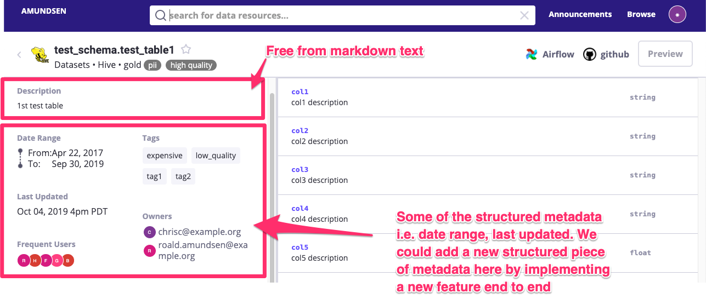
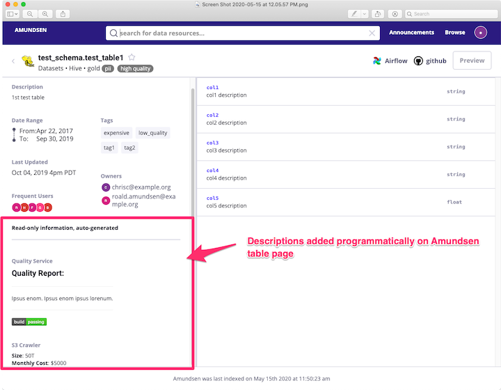
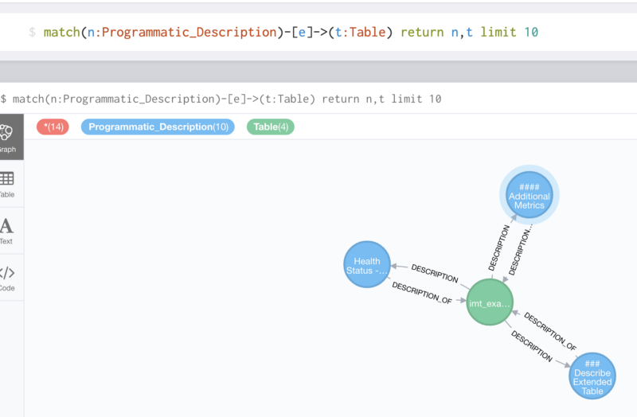
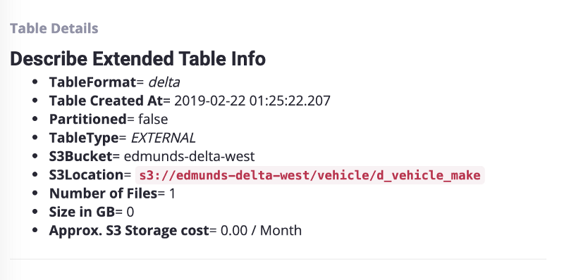
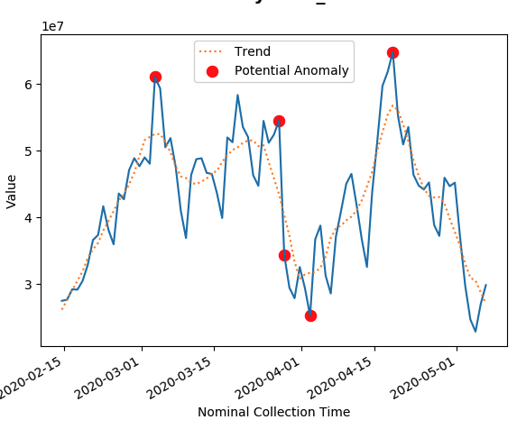

Imagine having a single place that houses all of the metadata that you ever could need. That was the Edmunds.com data team’s dream. Thanks to [Amundsen](https://github.com/lyft/amundsen), we are finally on the path towards that goal.

What is Amundsen? Amundsen is an open source data discovery & metadata engine with a community of 600+ people that is used by 15+ companies, including Edmunds. There are many great blog posts on Amundsen (a couple here: [overview](https://eng.lyft.com/amundsen-lyfts-data-discovery-metadata-engine-62d27254fbb9), [architecture and open-sourcing](https://eng.lyft.com/open-sourcing-amundsen-a-data-discovery-and-metadata-platform-2282bb436234 )), so I will not take any time to discuss the tool here. Instead, I will be telling you a tale of a specific type of metadata that we were trying to ingest, the barriers that we had to overcome to ingest this data and finally the happy ending that came about due to the wonders of open source technology.

* * *


## **The Background and Mission**

Many would say that bad data is worse than no data. Needless to say, "bad" or incorrect data could cost your company lots of money via flawed business decisions. Without instrumentation that can automatically give insights into anomalies and errors, you are at the mercy of the users of these datasets to QA the data as they run their reports or analyses. To combat this problem, a team at Edmunds.com developed a centralized anomaly detection tool. The specific details of this framework are beyond the scope of this post, but what is of interest is that this framework is a goldmine of useful data quality related information about our datasets. These are attributes like historical anomalies, the number of failing tests for a given day, and even whether a given dataset had any instrumentation attached. As our goal is to make Amundsen the single source of truth of our datasets, we needed to figure out a way to integrate this Data Quality information with Amundsen.

Unfortunately, this was not possible with the features that were in Amundsen at the time. It all came back to a problem that we had faced when looking into integrating other internal frameworks, namely that Amundsen supported only two types of table level metadata. These two options were specific, structured metadata, for example the timestamp that the table was last updated (for a whole list of what structured metadata is currently supported checkout the [readme](https://github.com/lyft/amundsen)), and structureless metadata via a single editable table description. In the image below you can see where these two types of metadata show up on a table detail page.



The metadata, like the data quality information, that we wished to extract from our internal libraries were highly unlikely to be covered by existing explicit table level features that Amundsen supported. This meant that if we were to go that route we would need to work on implementing each functional piece of metadata that we wished to integrate, which in most cases did not make sense to us as we did not think the community would get much value out of the specificity of our use-cases. As for leveraging the existing free-form table description, that was actually the first route we went when Amundsen was still pre-alpha at Edmunds. But unfortunately that meant that users would no longer have a spot to edit the table level description manually which as you can imagine is a huge pain-point. This eventually led to a cross-roads where we had two options:

* Fork Amundsen and implement features, like table level Data Quality reports, for Edmunds only.

    * This would put us in a tricky situation in the future when it comes to integrating Amundsen updates from the community.

* Create a new general concept that can be used for situations where a company wished to ingest schema-less text.

The community agreed that the second option would be useful. This concept became known as [Programmatic Descriptions](https://github.com/lyft/amundsen/issues/147).

* * *


## **Programmatic Descriptions**

#### What do they look like in Amundsen?



Above is an example of an Amundsen table page that you would see by following the [quickstart guide in the Amundsen databuilder](https://github.com/lyft/amundsen/blob/master/docs/installation.md#bootstrap-a-default-version-of-amundsen-using-docker). You can see that in this case, there are two sample programmatic descriptions in the bottom left. One is called "Quality Service" the other is called "S3 Crawler". Markdown, another [feature Edmunds added](https://github.com/lyft/amundsen/issues/98), gives us the ability to have some basic formatting as well as the possibility of embedding images such as that github style badge seen above.

#### So what are Programmatic Descriptions?

* They are table-level, free-form text metadata that originates from an automated source.

* A normal description is just a special case of a programmatic description.

* You can have N programmatic descriptions per a table.

* They are not editable in the UI.

* They are unique by table + a field called "description_source".

* They can be ordered by description_source via configuration on the frontend

    * You can see more details in [the frontend documentation](https://github.com/lyft/amundsenfrontendlibrary/blob/b25e4242ddf11e1f26cef0f1c412826ec174899a/docs/flask_config.md)

They can also be affiliated with "programmatic tags". More on this later

Below you can see the graphical visual of the one-to-many relationship between programmatic descriptions and tables. Each blue circle is a programmatic description which has a unique key that is derived from the description_source attribute. This way you can update existing programmatic description fields.



*A neo4j Query of Programmatic Descriptions (in blue).*

#### How do you create Programmatic Descriptions?

As mentioned earlier, you can create programmatic descriptions just like any other piece of TableMetadata. The key is that you need to set a description_source which is then used as part of the unique id in the metadata store. You can have one section of table metadata per description_source. As alluded to previously this also allows for programmatic descriptions to bring in programmatic tags of their own. For example if you had an s3 scraper job that was compiling the size, number of files and other attributes about large tables on s3, it may have logic to apply a tag (like "expensive" in the below example) if the size of the table is beyond a certain amount so that these tables can be easily accessed in Amundsen. 

The following is a construction of the [TableMetadata object](https://github.com/lyft/amundsendatabuilder/blob/master/databuilder/models/table_metadata.py) that you would include in your Extractor that will create programmatic descriptions:

```python
TableMetadata(
            database="my_database",  # type: str
            cluster="my_cluster",  # type: str
            schema="my_schema",  # type: str
            name="my_table",  # type: str
            description_source="s3_scraper",  # type: Union[str, None]
            description="Your markdown programmatic description here",  # type: Union[str, None]
            tags="expensive"  # type: Union[List, str]
            )
```
For a more detailed example take a look at the [sample data loader](https://github.com/lyft/amundsendatabuilder/blob/master/example/scripts/sample_data_loader.py) and the [programmatic sample data ](https://github.com/lyft/amundsendatabuilder/blob/master/example/sample_data/sample_table_programmatic_source.csv) that it loads. In these examples you will notice that it loads csvs. You can find the implementations of the csv extractors that are used in the examples [here](https://github.com/lyft/amundsendatabuilder/blob/master/databuilder/extractor/csv_extractor.py). At Edmunds, we actually use this same strategy to load programmatic descriptions, which requires that we have separate jobs that integrate directly with our internal tools that write the csvs for ingestion into Amundsen. For some cases this is necessary because the metadata is expensive to collect, for example s3 table statistics, and thus would not be performant running as a python application on airflow. However, in many cases, you could elect to skip out on the csv interface and include the integration code directly in your Amundsen ETL code. 

#### When would you use Programmatic Descriptions?

As mentioned previously, the main requirement is that you want/need the authoritative source of metadata to live outside of Amundsen. This obviously means that it can’t be editable in Amundsen.

But that alone can't be the only reason. You also will want some of the following to be true as well:

* You have table-level metadata that can be automatically scraped.

* Or, you have table level metadata that is human-generated but you don’t want it editable (perhaps in the future there will be another way to achieve this).

* Metadata is business-specific such that it wouldn’t ever make sense for Amundsen to have first-class support for this type of metadata.

* There isn’t first-class support for this type of metadata yet and you need it integrated ASAP.

* You need maximal flexibility in how the metadata looks.

#### When would you not use Programmatic Descriptions?

* For table-level metadata that is generic and would be better served as an explicitly integrated part of the UI.

    * We don't want everything to be dumped into free-form blob text like this!

* Any case where you need humans to edit this data in the UI

#### Example Integrations at Edmunds

Here we can see an example of a programmatic description that is used in production at Edmunds. 



We use programmatic descriptions heavily for various use cases at Edmunds. Some of the key use cases are:

* Table Level Details -> This provides specific information for a given table format such as partition key and the table format or the view ddl if it is a view. It also provides s3 information such as the size of the table, the number of s3 objects and the monthly s3 cost.

* Data Quality -> to show Data Quality and health of the data set, which I will describe more in the next section.

With Programmatic Descriptions integrated into Amundsen, we can now circle back to the original mission - integrating our data quality framework!

* * *


## **Integration of Data Quality Metadata**

With Amundsen updated to support the schemaless table-level metadata, it was time to circle back to the original integration goal. We decided to narrow the initial alpha scope to two main integration goals. 

Goal #1: Show a concept called a "health badge" which would be a summary of the health of a given dataset.

Goal #2: Display charts showing the historical behavior of a dataset and potential anomalies to provide context. 

#### Health Badges

The goal here was to provide a single dynamic badge that would indicate if the dataset is "healthy". Below you can see an image of each of our rendered badges that would be visible on the page as well as a definition of what they mean.


*Green* -> good to go, no anomalies or issues found


*Yellow* -> possible anomalies found, but none of the tests were flagged as high confidence


*Red* -> Do not use this dataset until further notice


*Unknown* -> There are are no metrics/tests setup for this dataset

One of the biggest pain points we hear from our users is that they have to QA a lot of the datasets themselves before they can run their analyses. This would mean having to run QA queries to take a look at certain aspects of the data such as counts by different subgroups and then comparing them week over week to see if it looks within norms before running the queries to generate the report that they are interested in. Having status badges that summarize the outcome of those QA queries that they would run manually will hopefully provide a page they can look at to have some guarantees on the quality of the dataset which could save them time.

The badges were implemented similarly to how git badges work as a simple rest request that returns an image.

```[](https://infrasight/api/v1/datasets/vehicle.d_modelyear/health)```

Clicking on the badge takes you to an endpoint that provides more information in JSON format.

The badges are dynamic so when the team backfills/fixes their data and refreshes the metrics, the badges will be updated with no refresh needed to Amundsen.

#### Chart Overview

A badge is great for giving a single distilled look into whether a dataset is doing ok, but what then? Some context is generally useful. One way to provide context is to provide historical charts showing these metric-values over time.

Ideally, for high-SLA metric-values, we can embed the charts directly into Amundsen.

These charts will flag potential historical anomalies as well as provide data trends. They are also clickable to get more metadata about the queries behind the metrics themselves.

Example of a chart (without title and axes) that shows the trend line and anomalies:



The charts are also rendered in markdown. Here is an example of what it looks like:

```
[)]
```
* * *


## **Conclusion and Looking Forward**

So there you have it, we were able to identify a set of useful metadata that we wanted available in Amundsen, contribute back to the project so that integration was possible and then successfully ingest it. The end result for Edmunds will hopefully be a reduction in the number of data-related incidents as well as a boost in analyst efficiency. If we had used a proprietary data discovery solution, it is very unlikely that we would have been able to achieve this level of customization. Plus, contributing back to an open-source project like this gives the added satisfaction of having helped the community so that others can jump straight into integration for any similar use-cases. 

After being properly rolled out in production at the beginning of 2020, Amundsen has filled a void in our data ecosystem and the feedback received through surveys has been very positive. Users like the ability to search through all of our tables, the consolidated metadata on a single page and the documentation. Currently, our core user base is limited to mostly data-scientists and analysts. One goal for this year is to evangelise the tool for use by other areas of the company where it is still largely unknown. This will also require that we ingest other data sources from different parts of the company. Thankfully, Amundsen makes it easy to ingest metadata from different systems without much customization. We hope that by the end of this year the whole company will know about Amundsen and will be using it to answer their data questions. 

We also hope to work on adding new types of metadata as well. Here are a couple of items that have been requested by various teams at the company.

**Legal Restrictions**

Using programmatic descriptions, we would like to ingest information provided to us by our legal department that states what should and should not be done with particular datasets due to contract requirements. Although a proof of concept has been implemented there is a lot of work remaining when it comes to the workflow of how this information should be updated as well as enforced.

**Tableau Dashboard Ingestion**

Somewhat unrelated to Data Quality and Programmatic Descriptions but an exciting feature nonetheless is the prospect of integrating dashboards into Amundsen which is now almost possible thanks to the great work the Lyft team has done on dashboard support. Although only Mode currently has integration implemented, it should be fairly straightforward to add a Tableau integration using the patterns laid out. Who knows, perhaps Edmunds.com will be able to contribute to the Tableau integration!

* * *

## Acknowledgements

*Special Thanks to David Reilly for implementing the data quality integration and to the Amundsen Community for all the guidance on the programmatic description feature.*

* * *

Do projects like this interest you? Edmunds is hiring: [https://www.edmunds.com/careers/](https://www.edmunds.com/careers/)

